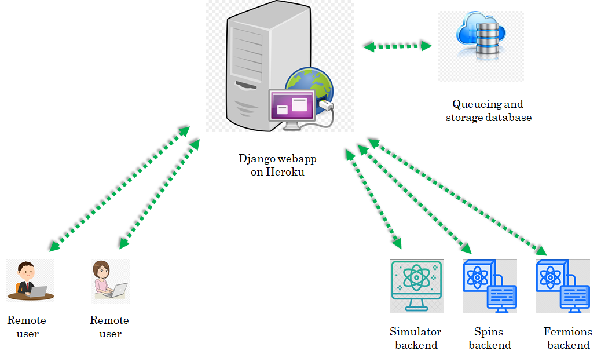

# General description
## The big picture
We want to use our quantum computing backends as platforms for executing experiments written as quantum circuits. These backends can be a real cold atom machine or a simulator running on a computer . But how will the backend understand a quantum circuit? For e.g. in our experiment we use the [labscript suite][labscript_github] to control all hardware and for data analysis. We need to tackle the following issues:

* Labscript suite does not have native support for writing quantum circuits.
* We want to allow remote users to be able to submit jobs to our backends. So we need a server architecture and user management.

The above issues can also exist for a simulator package. Hence the need for [this project][qlue_github]. There are two sides : [client](#the-client) and [server](#the-server).

## The client
A client is a remote user who will write quantum circuits in the user's favorite quantum circuit framework ([Qiskit][Qiskit_github]/[Pennylane][Pennylane_github]/something_else). These circuits then have to be compiled into JSON files. The JSON files can be sent over the internet to a remote server which will queue it for parsing/execution on the backend. The backend can be a real cold atom machine or a simulator running on a computer. To get credentials, user has to create an account at [qsimsim.synqs.org](https://qsimsim.synqs.org/).

We have decided on a schema for the JSON files. See [1][eggerdj_github]  for more details. The document mentions in detail how things should be formatted.

The plugin for compiling Qiskit circuits to JSON files is available at [1][eggerdj_github]. Similarly the plugin for compiling a pennylane circuit into JSON is available at [2][synqs_pennylane_github]. Note that the pennylane plugin at [2][synqs_pennylane_github] already offers several backends. Each backend is a device with its own operations.

That's all that is required on the client side. Basically choose one of these frameworks. If the client wants to use a different quantum circuit framework, then the client must write appropriate code for compiling quantum circuits of that framework into JSON files which follow the schema of [1][eggerdj_github].

## The server

### The Django app
The [Heroku][Heroku] platform hosts our [Django][Django_github] app. Django is a Python-based free and open-source web framework. It uses the Model-View-Template architecture:

* Model : Build databases from classes with the help of Object Relational Mapper (ORM).
* View : Function executed whenever a particular URL receives an HTTP request. For every URL there is a corresponding view function.
* Template : HTML/CSS code for inserting web elements in a HTML document.

Note that [Django][Django_github] is just a framework to design web-apps. Its not a server by itself. After writing a webapp it has to be hosted on a server. Although, Django also comes with a built-in server but this is meant only for local testing and development. In production environment one must use a proper server like [Apache web server][Apache], [Gunicorn][Gunicorn], [waitress][Waitress_github] etc. to host the webapp. For e.g. our Django app is hosted on a [Gunicorn][Gunicorn] server on the [Heroku][Heroku] platform.

Another point is that although we have a Django webapp running on our server, it is functionally equivalent to a REST API. REST API is a popular architecture of communicating with remote servers. [Django Rest Framework][DRF] is widely used for writing such REST APIs.

Before describing the server in detail, lets mention that for the client, communicating with the server essentially boils down to sending correct HTTP request to the correct URL. Then on the server side Django will execute the view function corresponding to that URL. The structure of a general URL looks like :

``
server_domain/requested_backend/appropriate_view_name
``

So for example if the ``server_domain=https://qsimsim.synqs.org/api/``, and we want to use ``post_job`` view for the ``fermions`` backend i.e.  ``requested_backend=fermions`` and ``appropriate_view_name=post_job``. The complete URL will look like :

``
https://qsimsim.synqs.org/api/fermions/post_job/
``

Now we explain different view functions and their purpose :

* **The get_config view** : This function returns a JSON dictionary containing the backend capabilities and details. At the moment this is relevant only for the Qiskit plugin as the pennylane plugin does not make use of it.
* **The post_job view** : This function extracts the JSON dictionary describing a potential experiment from a HTTP request. The extracted job_JSON is dumped onto **Dropbox** for further processing. It then responds with another JSON dictionary which has a ``job_id`` key. This job_id is important to query the server for results of the experiment later on. A typical JSON response from the server has the following schema:
``
{'job_id': 'something','status': 'something','detail': 'something'}
``
* **The get_job_status view** : This function extracts the job_id of a previously submitted job from a HTTP request. It responds with a JSON dictionary describing the status.
* **The get_job_result view** : This function extracts the job_id of a previously submitted job from a HTTP request. If the job has not finished running and results are unavailable, it responds with a JSON dictionary describing the status. Otherwise it responds with a JSON dictionary describing the result. The formatting of the result dictionary is described in [1][eggerdj_github].
* **The get_user_jobs view** : This function returns a JSON dictionary containing all the jobs a user has submitted to this particular backend.
* **The get_next_job_in_queue view** : This function is not available to regular users. It is a very special function and is reserved for use only by the Spooler machine. Basically Spooler machine is the computer which is running the Spooler. It asks the server for the next job it should work on and the server replies with a JSON dictionary with details of the next job to be executed. From this, the Spooler knows exactly where the job JSON file is stored on Dropbox. It fetches the job JSON and starts to process it. Note that different Spoolers exist for different backends.

We will frequently use the term status dictionary and result dictionary. These are just text files which host the appropriate JSON data. These files are stored on the Dropbox like job_JSON. When a view reads these text files, it coverts the data in them to a python dictionary and sends it to the client or modifies the dictionary further before saving it back to the text file.

Since we use Dropbox to store JSONs, the view functions call functions written in a file called ``storage_providers.py`` which in turn calls Dropbox python API functions for reading and writing to Dropbox. Note that Dropbox can be **replaced** with any other storage service (like Amazon S3, Microsoft azure storage, Google cloud storage etc.) which allows a user to read and write content using a python API. For this one would need to implement four basic functions for accessing the cloud storage provider. The details of these four functions are given in ``storage_providers.py`` with an example implementation for Dropbox. A new storage service can have its own class inheriting from the base class (just like the Dropbox class) and override the base functions.

### The Dropbox storage
We use Dropbox to store all our JSONS. This approach has several benefits:

* We immediately implement asynchronous job management. Basically the Heroku server dumps the job coming from the remote client onto Dropbox. Then whenever the Spooler belonging to a backend is free, it will query to ``get_next_job_in_queue`` view and act on the next job which is appropriate for that particular backend.
* Dropbox also serves as a database storage for various JSONs, like job_JSON, result_JSON, status_JSON etc. It gives us 2 GB free storage which is a lot considering price of commercial database alternatives.
* It allows us to unify the workflow for both simulator and real machine. Basically it does not matter what the backend is, the workflow is the identical. Different backends only differ in their Spoolers.

Now we describe how the Dropbox folder structure is organized. It is shown in following picture:

If one plans to replace Dropbox with other storage service, then one needs to implement a folder/naming structure similar to above.

Now lets give an example about the work flow. Lets say a remote client named ``user_1`` submits a job to the singlequdit backend. This means ``user_1`` sent a  post request to the following URL:

``
https://qsimsim.synqs.org/api/singlequdit/post_job/
``

The server will immediately save the JSON to **Dropbox** at ``Backend_files/Queued_Jobs/singlequdit/job-20210906_203730-singlequdit-user_1-1088f.json``. The JSON file name has special meaning as will be explained later. The file is stored here temporarily before spooler processes it. At the same time the server will reply to the user with a job_id response which might look something like :

``
{'job_id': '20210906_203730-singlequdit-user_1-1088f','status': 'INITIALIZING','detail': 'Got your json.'}
``

This dictionary is also saved as a status JSON at ``Backend_files/Status/singlequdit/user_1/status-20210906_203730-singlequdit-test-1088f.json``. Note the name is quite similar to the job JSON except a ``status-`` prefix.

The ``job_id`` key-value has lot of information. It has the UTC date and time of creation of the job ``20210906_203730`` which means it was created on 6 September 2021 at 20:37:30 PM UTC time. The job_id also has the user name who created this job i.e. ``user_1`` and the backend where this job is supposed to be executed i.e. ``singlequdit``. At the end the job has some random alpha-numeric string of 5 characters.

On the spooler side, it will query the server for the next job it should work on. Also let us suppose the spooler is querying about the next job for ``singlequdit`` backend. The server looks for the file list in the directory ``Backend_files/Queued_Jobs/singlequdit/``. It will choose the first created file from that list. Lets say this is the file ``job-20210906_203730-singlequdit-user_1-1088f.json``. Now the server will move this file from ``Backend_files/Queued_Jobs/singlequdit/job-20210906_203730-singlequdit-user_1-1088f.json`` to ``Backend_files/Running_Jobs/job-20210906_203730-singlequdit-user_1-1088f.json`` and respond to the spooler with a ``job_msg_dict`` which looks like

``{"job_id": "20210906_203730-singlequdit-user_1-1088f", "job_json": Backend_files/Running_Jobs/job-20210906_203730-singlequdit-user_1-1088f.json"}``

From this, the Spooler knows exactly where the job JSON file is stored on Dropbox. It fetches the job JSON and starts to process it.

For processing the job, the spooler begins by sanity-checking the JSON for correct schema. If the job_JSON fails this check the file is moved to  `` Backend_files/Deleted_Jobs/job-20210906_203730-singlequdit-user_1-1088f.json ``. The status JSON is also updated by the spooler to:

``
{'job_id': '20210906_203730-singlequdit-user_1-1088f','status': 'ERROR','detail': 'Got your json.; Failed json sanity check. File will be deleted. Error message : blah..blah'}
``

From the dictionary, the user is automatically informed about the details of why the error happened.

If however, the job_JSON passes sanity checking, then it is executed. The spooler goes through the instruction list and creates the appropriate circuit and calculates the end result. Then it generates the given number of shots and formats everything into the result dictionary. The schema of the result dictionary is given at [1][eggerdj_github]. Then the Spooler will upload the result JSON to ``Backend_files/Result/singlequdit/user_1/result-20210906_203730-singlequdit-user_1-1088f.json``. It will also move the job JSON from ``Backend_files/Running_Jobs/job-20210906_203730-singlequdit-user_1-1088f.json`` to  ``Backend_files/Finished_Jobs/singlequdit/user_1/job-20210906_203730-singlequdit-user_1-1088f.json``. Finally the spooler will update the status JSON to:

``
{'job_id': '20210906_203730-singlequdit-user_1-1088f','status': 'DONE','detail': 'Got your json.; Passed json sanity check; Compilation done. Shots sent to solver.'}
``

This completes the execution of the job and the results are now available.

### The backends
The backend can be a real cold atom machine or a simulator running on a computer. In summary, the backend runs a spooler which is responsible for executing job_JSONs and updating status_JSONs and result_JSONs. However different backends have different Spoolers. The Spoolers of different simulator backends have similar structure. The experiment backends have slightly different implementation of spoolers. This is because simulators and real machine operate in different conditions. We first describe the simulator backend and then the experiment one.

#### The simulator backend
This is just a PC running spooler(s). The directory structure of Spooler is:

The important file is the **maintainer.py**. It runs an endless while loop. Every 2 seconds The maintainer.py asks the serevr for the next job to be executed for a particular backend. If the server replies with a job, the maintainer will execute the appropriate Spooler.py file for that backend. If the server replied with empty response then the loop continues and maintainer.py will ask for job for the next backend defined in the list ``backends_list ``.

Lets consider the case where the server replied with a job name. The maintainer will download the contents of this job_JSON and also the status_JSON. Both the job dictionary and status dictionary are passed as an argument to the ``add_job `` function of the appropriate Spooler for that backend.

The ``add_job `` function will perform sanity check on the JSON and execute the circuit. Then it will upload all results and status accordingly. The details on how exactly the circuits are executed will be described in future. If you are curious just look up the code.

Also note that for reading writing to Dropbox on the Spooler PC too use Dropbox python API. The commands are in the file ``drpbx.py``

There are some important points to note here:

* The maintainer.py is a python program. It might very well crash and then our simulator is no longer executing circuits. Although the server is still fine and storing jobs properly but the jobs will be in waiting queue as long as the Spooler is dead. As a quick fix to this problem, we do not run the maintainer.py file directly. Instead we have a bash script ``keep_running.sh`` which runs the maintainer.py in a loop. If python file crashes the bash script will automatically restart it. This is a temporary fix for now and will be replaced by a more professional solution using ``cron`` or ``supervisord`` in near future.
* The spooler is a virtual machine (VM) living in the cloud. We need a professional way to deploy the code on the VM. This support also will be included in near future where whenever a developer makes a push to the Spooler github repository ``coquma-sim-spooler``, the new files are automatically copied and deployed to the VM.

All code for the spoolers is in a separate GitHub repository which we will make public later on.

#### The experiment backend
A first draft for implementing the experiment backends is highlighted [here][labscript_qc].

[qlue_github]: https://github.com/synqs/qlue "qlue"
[Qiskit_github]: https://github.com/Qiskit "Qiskit"
[Pennylane_github]: https://github.com/PennyLaneAI "Pennylane"
[eggerdj_github]: https://github.com/eggerdj/backends/ "Qiskit_json"
[synqs_pennylane_github]: https://github.com/synqs/pennylane-ls "penny_json"
[Heroku]: https://www.heroku.com/home "Heroku"
[Waitress_github]: https://github.com/Pylons/waitress "Waitress"
[Django_github]: https://github.com/django "Django"
[Apache]: https://httpd.apache.org/ "Apache"
[Gunicorn]: https://gunicorn.org/ "Gunicorn"
[DRF]: https://github.com/encode/django-rest-framework "DRF"
[labscript_github]: https://github.com/labscript-suite "labscript"
[labscript_qc]: https://github.com/synqs/labscript-qc "labscript-qc"
